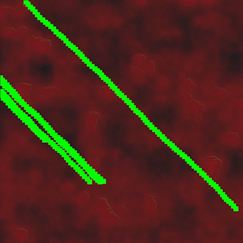

# Germination 🐛 🦠

Author: Darwin Do

*Germination* is a generative art piece created in the Processing framework. Inspired by the growth pattern of [slime mold networks](https://www.wired.com/2010/01/slime-mold-grows-network-just-like-tokyo-rail-system/), ***********Germination*********** uses Perlin noise and a modified breadth-first-search algorithm to visualize the lifecycle of networks of points that grow and die in a constantly changing noise field.

    

# Progressive Ideation

Right off the bat, I knew I wanted to work with Perlin noise in mind. [Perlin noise](https://en.wikipedia.org/wiki/Perlin_noise) is a type of noise that uses gradient maps to produce random values instead of the basic unstructured pseudo-random number generators that come in programming languages. I thought it was super cool how Minecraft uses Perlin noise for [world generation](https://www.youtube.com/watch?v=CSa5O6knuwI) and wanted to do something with that. Thankfully, the default `noise()` function in Processing uses Perlin noise by default, so I could start experimenting right away!

To map noise values to colors, I used the (x, y) coordinate of each pixel as parameters to the noise function. These coordinates are then scaled down heavily so that the “smoothness” of the gradient noise can be exemplified in the resulting colors. I initially had a light blue-white background that resembled a clear sky, but I eventually opted for a darker tone with the red-black mapping from the noise values. For simplicity’s sake, I added kept the green and blue values of the background pixels and only changed the red value based off the noise output.

## Adding in Movement

To make things more dynamic, I added movement by initially adding a value to the noise parameters that increased linearly over time. I also added in some extra dots and had them “move” along the diagonal of the canvas to simulate something “swimming” in the noise sea.

 

    

This was pretty cool, but I wanted to make things more exciting and less predictable. I also needed to factor in the screen dimension aspect to fulfill the assignment criteria. After much iteration and playing around with different algorithms for changing the movement of the green dots and the background noise, I ended up making something that reminds me of a growing network of organisms/civilizations/creatures. The green nodes are placed randomly around the canvas and can move in any direction (except that direction they just came from). This mimics a “breadth-first-search” behavior where the nodes perform their search as widely as possible. Wherever the nodes go, they leave behind a trail of static dots that resemble the functionality of the classic Snake game. Every iteration though, there is a chance that:

1. The node is teleported to a new location
2. A new node is added at exactly the same spot (effectively splitting the “head” into 2 heads)
3. A new node is added in a random location
4. A random node is deleted
5. A random static dot is deleted

This creates an exciting environment where the green mass is constantly in movement and in growth. After a variable amount of time, the background is “reset” and a new noise map is drawn out with a different noise seed. This creates a new backdrop for the nodes to grow in, and it also resets the nodes back to an earlier point in time. The speed of the reset is determined by the size of the canvas. Smaller canvases have faster reset times and are packed with much more chaotic energy. Larger canvases move much slower and give plenty of time for the nodes to spread out their colonies before resetting the noise map. 

## Performance Issues

One problem I ran into was performance issues between the Pi and my development computer. Initially, my Processing sketch ran very smoothly on my computer, even with thousands of green dots on the screen. When I started testing on my Pi connected to my 42in TV however, the sketch was very sluggish and slow to update. I responded by adding additional delays in the update interval and adjusting the periodicity of the “extinction events” which kill off many green nodes.

# Video Demo

The following video showcases ***********Germination*********** running on my Raspberry Pi connected to a 42in TV display. The video starts from the bootup of the Pi to demonstrate the ability for the `.desktop` entry to automatically start the program in full screen upon boot. Notice how different the art piece looks on the larger TV screen compared to a smaller canvas size. 

## 42in TV Example (Sketch opens at 0:50)

[https://www.youtube.com/watch?v=XMF0wsTU0vc](https://youtu.be/V2qYnOAsamw)

This is a screen-recording from my computer with the sketch running in a 1024x1024 canvas. Please don’t mind the music, I forgot that OBS could pick up my Spotify sounds as well and didn’t realize this until the YouTube video was already uploaded. I don’t think it’s too out-of-place so I kept it in, but this is not a part of the generative piece.

## 1024x1024 Example

[https://www.youtube.com/shorts/vWqmeOZgUF8](https://www.youtube.com/shorts/vWqmeOZgUF8)

## 250x250 Example

    

# Source Code:

[https://github.com/dsmaugy/cpsc334-germination](https://github.com/dsmaugy/cpsc334-germination)